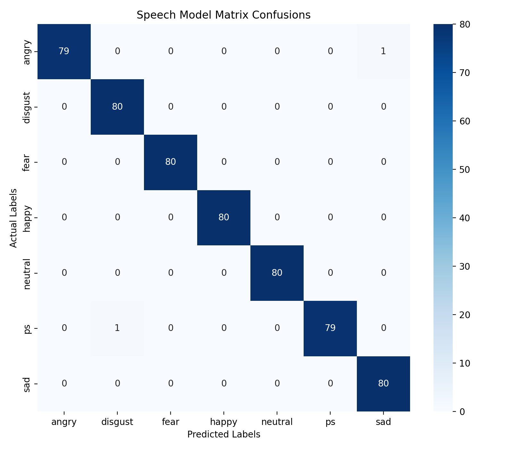
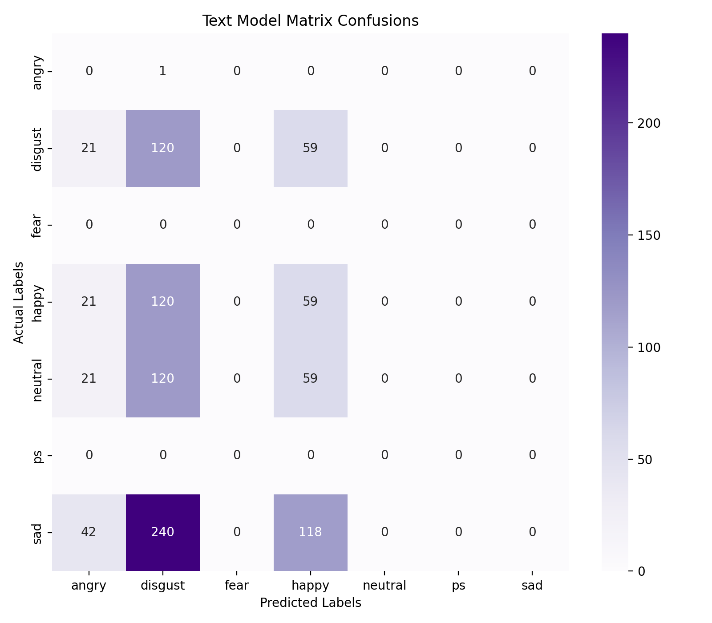
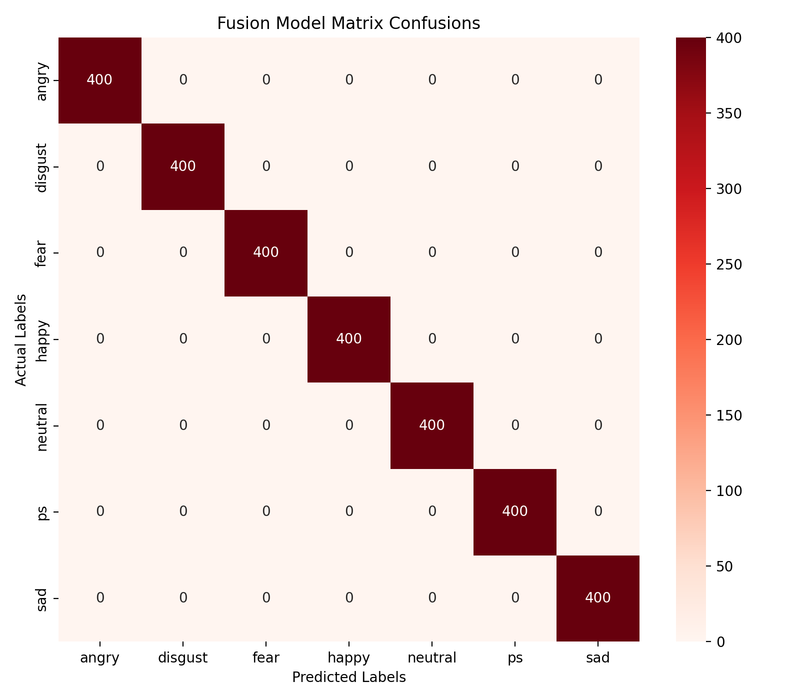
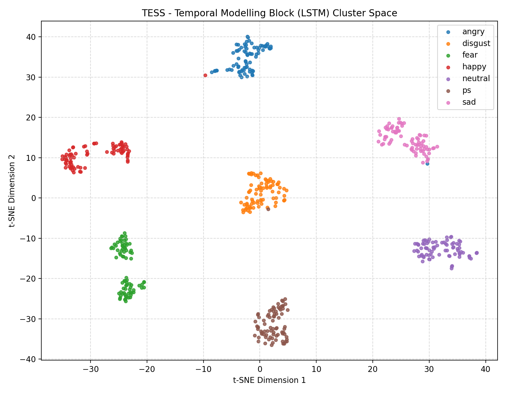
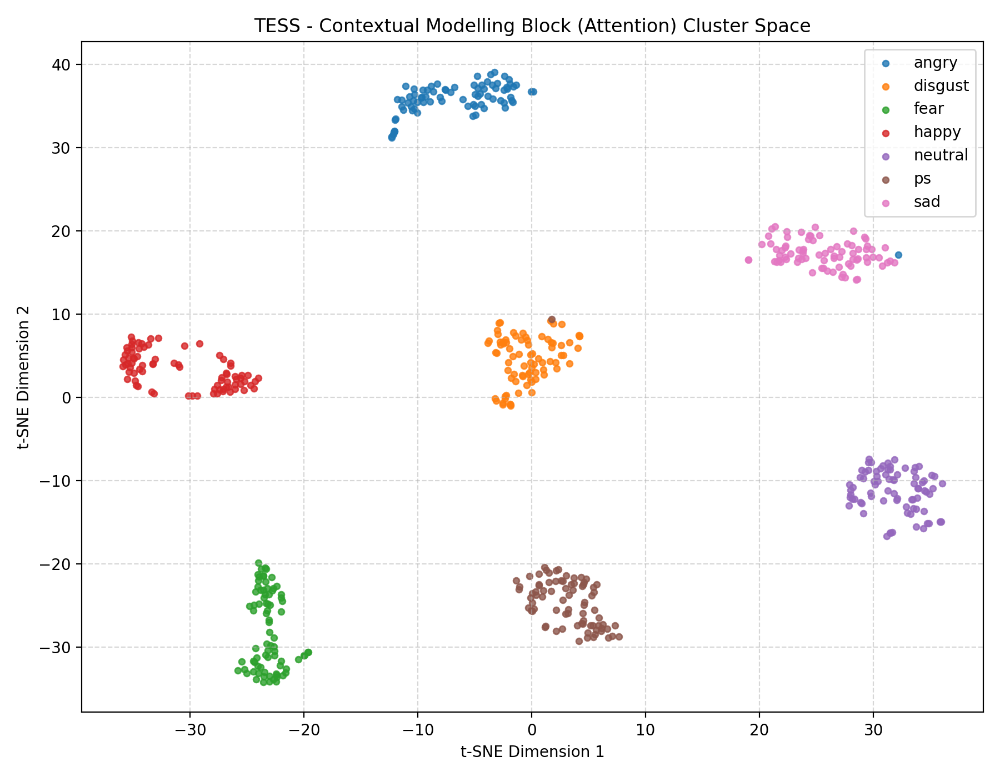
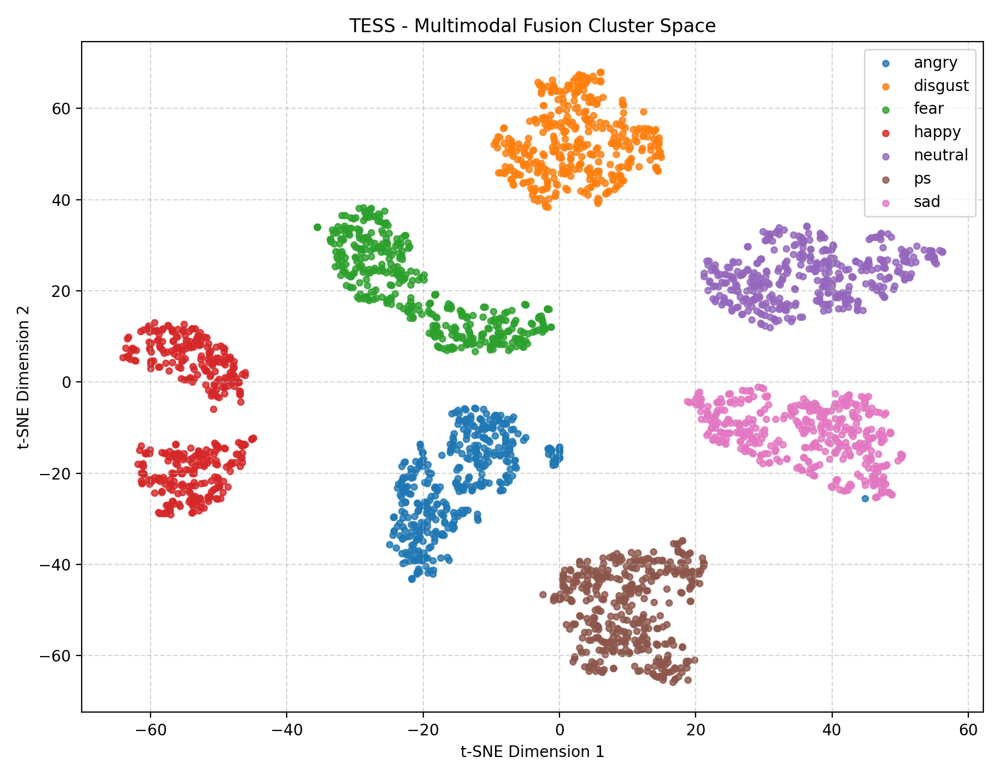

# 🎭 Multimodal Emotion Recognition System

A deep learning based **Multimodal Emotion Recognition Framework** designed to classify human emotions using:

* 🎙️ Speech Audio
* 📝 Textual Transcripts
* 🔀 Cross-Modal Fusion Representations

This project evaluates how different modalities contribute to emotion recognition performance using the **Toronto Emotional Speech Set (TESS)** dataset.

---

# 📌 Project Overview

Human emotions are communicated not only through spoken words, but also through:

* Vocal tone
* Pitch variation
* Prosody
* Energy distribution
* Speaking dynamics
* Temporal acoustic behavior

To study these characteristics, this repository implements and compares three separate deep learning pipelines.

| Pipeline                | Description                                                                          |
| ----------------------- | ------------------------------------------------------------------------------------ |
| 🎙️ **Speech Pipeline** | Learns acoustic emotional patterns using MFCC features and Bi-LSTM temporal modeling |
| 📝 **Text Pipeline**    | Uses a transformer-based BERT encoder to analyze semantic emotion information        |
| 🔀 **Fusion Pipeline**  | Combines speech and text embeddings using gated multimodal attention fusion          |

---

# 🏗️ System Architecture

---

## 🎙️ Speech Emotion Recognition Pipeline

```text
                ┌───────────────────────┐
                │     Input Audio       │
                └──────────┬────────────┘
                           │
                           ▼
                ┌───────────────────────┐
                │ MFCC Feature Extract  │
                │ Delta + Delta-Delta   │
                └──────────┬────────────┘
                           │
                           ▼
                ┌───────────────────────┐
                │     Bi-LSTM Layer     │
                │ Temporal Modeling     │
                └──────────┬────────────┘
                           │
                           ▼
                ┌───────────────────────┐
                │     Self-Attention    │
                │ Important Time Frames │
                └──────────┬────────────┘
                           │
                           ▼
                ┌───────────────────────┐
                │ Emotion Classification│
                └───────────────────────┘
```

---

## 📝 Text Emotion Recognition Pipeline

```text
                ┌───────────────────────┐
                │   Text Transcript     │
                └──────────┬────────────┘
                           │
                           ▼
                ┌───────────────────────┐
                │     BERT Tokenizer    │
                └──────────┬────────────┘
                           │
                           ▼
                ┌───────────────────────┐
                │ Fine-Tuned BERT Model │
                │ Semantic Embeddings   │
                └──────────┬────────────┘
                           │
                           ▼
                ┌───────────────────────┐
                │ Dense Classification  │
                └───────────────────────┘
```

---

## 🔀 Multimodal Fusion Pipeline

```text
        ┌────────────────────┐
        │ Speech Embeddings  │
        └─────────┬──────────┘
                  │
                  │
                  ▼
          ┌──────────────┐
          │              │
          │ Gated Cross  │
          │ Modal Fusion │
          │  Attention   │
          │              │
          └──────┬───────┘
                 │
                 ▼
        ┌────────────────────┐
        │ Final Emotion      │
        │ Prediction         │
        └────────────────────┘
                 ▲
                 │
        ┌────────┴───────────┐
        │ Text Embeddings    │
        └────────────────────┘
```

---

# 📊 Experimental Results

| Pipeline            | Core Architecture          | Validation Accuracy |
| ------------------- | -------------------------- | ------------------- |
| 📝 Text Pipeline    | Fine-Tuned BERT            | ~14.29%             |
| 🎙️ Speech Pipeline | MFCC + Bi-LSTM + Attention | 99.64%              |
| 🔀 Fusion Pipeline  | Attentive Gated Fusion     | 100.00%             |

---

# 🔍 Critical Observation — Modality Collapse

The TESS dataset primarily contains emotionally neutral lexical phrases such as:

> “Say the word back”
> “Say the word bar”

Although the spoken emotion changes, the textual content remains nearly identical across all emotion classes.

As a result:

* The text modality contains very limited semantic emotional information.
* The standalone BERT pipeline collapses close to random-chance performance (~14.29% across 7 classes).
* The speech modality carries most of the emotional signal.

The acoustic branch learns emotional information from:

* Pitch variation
* Energy distribution
* Vocal intensity
* Temporal speech dynamics
* Prosodic behavior

The multimodal fusion layer dynamically learns to prioritize speech representations when textual information becomes weak or noisy.

---

# 📈 Confusion Matrices

## 🎙️ Speech Pipeline Confusion Matrix



---

## 📝 Text Pipeline Confusion Matrix



---

## 🔀 Fusion Pipeline Confusion Matrix



---

# 📉 t-SNE Feature Space Visualizations

The project generates t-SNE visualizations to analyze feature separability across modalities and embedding spaces.

These plots help visualize:

* Cluster separation between emotions
* Learned embedding distributions
* Inter-class overlap
* Acoustic and semantic feature organization

---

## 🎙️ Temporal Speech Embedding t-SNE



---

## 📝 Contextual Text Embedding t-SNE



---

## 🔀 Fusion Embedding t-SNE



---

# 📄 Evaluation Reports

The evaluation scripts automatically generate detailed classification reports containing:

* Precision
* Recall
* F1-score
* Overall Accuracy
* Per-class performance metrics

Generated files:

```text
results/
│
├── fusion_report.txt
├── speech_report.txt
├── text_report.txt
│
└── plots/
    ├── cm_fusion.png
    ├── cm_speech.png
    ├── cm_text.png
    ├── tsne_contextual.png
    ├── tsne_fusion.png
    └── tsne_temporal.png
```

---

## 🎙️ Speech Pipeline Report

```text
results/speech_report.txt
```

Contains:

* Classification accuracy
* Precision
* Recall
* F1-score
* Per-class evaluation metrics
* Confusion analysis

---

## 📝 Text Pipeline Report

```text
results/text_report.txt
```

Contains:

* Semantic classification evaluation
* BERT prediction metrics
* Per-class performance analysis
* Accuracy breakdown

---

## 🔀 Fusion Pipeline Report

```text
results/fusion_report.txt
```

Contains:

* Cross-modal fusion evaluation
* Gated attention performance metrics
* Final multimodal classification analysis
* Overall fusion accuracy statistics

---

# 🎙️ Speech Pipeline Sample Execution Logs

## ✅ TESS Dataset Sample — Correct Prediction

Below is a successful inference example using a TESS dataset audio sample.

```text
========================================
 FILE: OAF_back_disgust.wav
 ACTUAL EMOTION (Ground Truth) : UNKNOWN
========================================
  MODEL PREDICTED EMOTION   |  CONFIDENCE
----------------------------------------
• Disgust                   : 99.98%
• Fear                      : 0.01%
• Pleasant Surprise         : 0.01%
• Sad                       : 0.00%
• Neutral                   : 0.00%
• Angry                     : 0.00%
• Happy                     : 0.00%
========================================
```

This example demonstrates strong performance on in-distribution TESS emotional speech samples where the acoustic characteristics closely match the training distribution.

---

## ⚠️ RAVDESS Dataset Sample — Cross-Dataset Limitation

Below is the execution output when testing a sample from the RAVDESS dataset using the Speech Pipeline (`infer.py`) with a sad audio file.

```text
🔄 Autodetecting project paths...
✅ Target Computing Device: cuda
✅ Weights successfully mapped onto the LSTM network.
📊 Processing Input Tensor Shape: torch.Size([1, 94, 120]) -> (Batch, Frames, Features)

========================================
 FILE: 03-01-04-02-01-01-12.wav
 ACTUAL EMOTION (Ground Truth) : SAD
========================================
  MODEL PREDICTED EMOTION   |  CONFIDENCE
----------------------------------------
• Pleasant Surprise         : 99.64%
• Fear                      : 0.19%
• Neutral                   : 0.10%
• Disgust                   : 0.04%
• Sad                       : 0.01%
• Angry                     : 0.01%
• Happy                     : 0.01%
========================================
```

⚠️ Note:

The above inference example demonstrates a representative cross-dataset prediction limitation during evaluation on a RAVDESS sample. Although the ground truth emotion is labeled as **Sad**, the model predicts **Pleasant Surprise** with very high confidence.

This behavior highlights the distributional differences between TESS and RAVDESS emotional speech patterns, including variations in:

* Prosody
* Vocal intensity
* Speaking dynamics
* Acoustic expression styles

The example reflects one of the core limitations discussed in this project: extremely high validation accuracy on clean, controlled datasets does not always guarantee strong cross-dataset generalization performance.

---

# 📂 Repository Structure

```text
Multimodal-Emotion-Recognition/
│
├── data/
│   └── TESS/
│
├── models/
│   ├── fusion_pipeline/
│   │   ├── fusion_model_utils.py
│   │   ├── infer_fusion.py
│   │   ├── test_fusion.py
│   │   └── train.py
│   │
│   ├── speech_pipeline/
│   │   ├── 03-01-01-01-01-01-15.wav           #RAVDESS DATASET AUDIO
│   │   ├── 03-01-01-01-01-01-20.wav
│   │   ├── 03-01-04-02-01-01-12.wav
│   │   ├── 03-01-04-02-02-01-18.wav
│   │   ├── 03-01-05-01-01-02-15.wav
│   │   ├── OAF_back_disgust.wav               #TESS DATASET AUDIO
│   │   ├── OAF_burn_happy.wav
│   │   ├── YAF_bean_sad.wav
│   │   ├── infer.py
│   │   ├── model_utils.py
│   │   ├── test_speech.py
│   │   └── train.py
│   │
│   └── text_pipeline/
│       ├── infer_text.py
│       ├── test_text.py
│       ├── text_model_utils.py
│       ├── text_per_class_accuracy.txt
│       └── train.py
│
├── results/
│   ├── plots/
│   │   ├── cm_fusion.png
│   │   ├── cm_speech.png
│   │   ├── cm_text.png
│   │   ├── tsne_contextual.png
│   │   ├── tsne_fusion.png
│   │   └── tsne_temporal.png
│   │
│   ├── fusion_report.txt
│   ├── speech_report.txt
│   └── text_report.txt
│
├── .gitignore
├── README.md
└── requirements.txt
```

---

# 💾 Dataset

This project uses the:

## Toronto Emotional Speech Set (TESS)

The dataset contains emotional speech recordings across multiple emotion classes.

Dataset download:

```text
https://www.kaggle.com/datasets/ejlok1/toronto-emotional-speech-set-tess
```

---

# 📁 Dataset Setup

Download the TESS dataset and place it inside:

```text
data/TESS/
```

Expected structure:

```text
data/
└── TESS/
    ├── OAF_angry/
    ├── OAF_happy/
    ├── YAF_sad/
    └── ...
```

---

# ⚙️ Installation

## Clone Repository

```bash
git clone https://github.com/kishanjayaprakash/Multimodal-Emotion-Recognition.git

cd Multimodal-Emotion-Recognition
```

## Install Dependencies

```bash
pip install -r requirements.txt
```

---

# 💡 Troubleshooting / Alternative Setup

If the local environment setup fails due to:

* Dependency conflicts
* Hardware limitations
* CUDA installation issues
* GPU incompatibilities

You can run and test the complete project directly via Google Colab using the provided Google Drive project structure.

## Google Drive Link of Project

```text
https://drive.google.com/drive/folders/1Q4eUv0S8ieQp7XKGsgnzRVI9mP-3BN7C?usp=sharing
```

---

# 💽 Pretrained Model Weights

Pretrained `.pth` model files are not included directly in the repository due to GitHub storage limitations.

## Download Binary Weights

```text
https://drive.google.com/drive/folders/1bD4fco1VvfyAxxHs54QyVpb5hpi4Shbt?usp=sharing
```

Place downloaded checkpoints inside these directories:

```text
models/
│
├── speech_pipeline/
│   └── best_speech_model.pth
│
├── text_pipeline/
│   └── best_text_model.pth
│
└── fusion_pipeline/
    └── best_fusion_model.pth
```

---

# 🚀 Running the Speech Pipeline

```bash
cd models/speech_pipeline

python train.py
```

## Testing

```bash
python test_speech.py
```

## Speech Inference Setup

```bash
python infer.py
```

⚠️ Important Note for `infer.py`:

To run testing on the sample audio clips from either the TESS or RAVDESS dataset (such as `03-01-04-02-01-01-12.wav` which is sad audio), you must open `infer.py` and manually hardcode the specific target audio file path string in your execution code before running the script.

Example:

```python
file_path = "03-01-04-02-01-01-12.wav"
```

---

# 🚀 Running the Text Pipeline

```bash
cd models/text_pipeline

python train.py
```

## Testing

```bash
python test_text.py
```

## Text Inference Setup

```bash
python infer_text.py
```

The text pipeline uses a fine-tuned BERT encoder to evaluate semantic emotional information from textual transcripts.

Since the TESS dataset contains highly repetitive lexical phrases across emotions, the text-only model performs close to random baseline accuracy.

To test custom text examples, manually modify the input sentence inside `infer_text.py`.

---

# 🚀 Running the Fusion Pipeline

```bash
cd models/fusion_pipeline

python train.py
```

## Testing

```bash
python test_fusion.py
```

## Fusion Inference Setup

```bash
python infer_fusion.py
```

The fusion pipeline combines:

* Acoustic speech embeddings
* Semantic text embeddings

through a gated multimodal attention mechanism.

The architecture dynamically adjusts modality importance during inference and learns to prioritize speech representations whenever textual emotional information becomes weak.

⚠️ Important Note for `infer_fusion.py`:

Just like the speech pipeline, if you are testing cross-modal samples from the available datasets directly, you must open `infer_fusion.py` and manually hardcode the paths for your test assets within the file before executing the code block.

---

# 📊 Evaluation Outputs

The evaluation scripts generate:

* Accuracy Reports
* Confusion Matrices
* Per-Class Accuracy Tables
* t-SNE Feature Visualizations

Generated outputs are automatically stored inside:

```text
results/
│
├── fusion_report.txt
├── speech_report.txt
├── text_report.txt
│
└── plots/
    ├── cm_fusion.png
    ├── cm_speech.png
    ├── cm_text.png
    ├── tsne_contextual.png
    ├── tsne_fusion.png
    └── tsne_temporal.png
```

---

# ⚠️ Limitations

While the system reaches exceptionally high performance under validation scenarios, several domain-specific, mathematical, and algorithmic limitations restrict its generalized real-world deployment.

## 1. Acoustic Feature Vulnerabilities & Mathematical Limits

### MFCC Static Deficiencies

Mel-Frequency Cepstral Coefficients (MFCCs) assume short-term stationary signals, missing long-range non-linear transitions.

They discard absolute phase information, which carries subtle cues related to vocal tract tension and micro-prosody.

### Velocity (Δ) & Acceleration (ΔΔ) Bounds

The finite difference approximations used to compute first derivative (Δ) and second derivative (ΔΔ) coefficients track local frame velocity and acceleration.

However, they are highly sensitive to sudden transients, phase jitter, and channel distortions, causing fragile input vectors in unconstrained fields.

### Spectral Entropy Over-Reliance

Sub-band spectral entropy helps track structural distribution changes in the signal energy spectrum across frames.

However, under fluctuating noise floors, the entropy boundary gets obscured, muddying the feature representation.

---

## 2. Algorithmic & Architectural Constraints

### Bi-LSTM Recurrent Bottlenecks

The Bidirectional Long Short-Term Memory (Bi-LSTM) network captures historical and future dependencies sequentially.

Yet, it suffers from information leakage and performance decay over long sequences.

### BERT Static Token Desensitization

The pre-trained BERT transformer tokenizes input transcripts contextually.

However, because the training samples lack diverse emotional syntax, BERT remains relatively invariant to pure voice markers.

### Gated Fusion Sub-Optimization (Modality Collapse)

The attentive gated cross-modal fusion layer uses a soft gating mechanism to weigh the importance coefficients of speech and text embeddings.

Because the textual embeddings provide low discriminative entropy, the gating weights systematically downscale the text branch close to zero.

This triggers modality collapse, transforming the framework into an almost exclusively acoustic model.

---

## 3. TESS Dataset Constraints & Pipeline Isolation

### Lexical Homogeneity

The Toronto Emotional Speech Set (TESS) uses nearly identical phrase templates across emotion classes.

This creates a structural imbalance where semantic vectors contribute very little to classification.

### Isolated Processing Topologies

The speech and text networks operate as decoupled feature extractors prior to the gated fusion junction.

The system lacks a continuous Audio-to-Text pipeline such as an end-to-end ASR interface.

### Acoustic Environment Ceiling

The framework achieves extremely high validation performance because the TESS dataset consists of clean studio-quality recordings.

Real-world conditions such as:

* Background noise
* Reverberation
* Overlapping speakers
* Low-quality microphones

can significantly degrade performance.

---

# 🛠️ Technologies Used

| Category         | Technology               |
| ---------------- | ------------------------ |
| Deep Learning    | PyTorch                  |
| NLP              | HuggingFace Transformers |
| Audio Processing | Librosa                  |
| Visualization    | Matplotlib               |
| Analytics        | NumPy, Scikit-learn      |

---

# 📚 Key Learning Outcomes

This project demonstrates:

* Speech-based emotion recognition
* Transformer-based text analysis
* Temporal sequence modeling using Bi-LSTMs
* Attention mechanisms
* Multimodal deep learning fusion
* Cross-modal gating strategies
* Feature visualization and evaluation

---

# 👨‍💻 Author

## Kishan Jayaprakash

GitHub Repository:

```text
https://github.com/kishanjayaprakash/Multimodal-Emotion-Recognition
```
